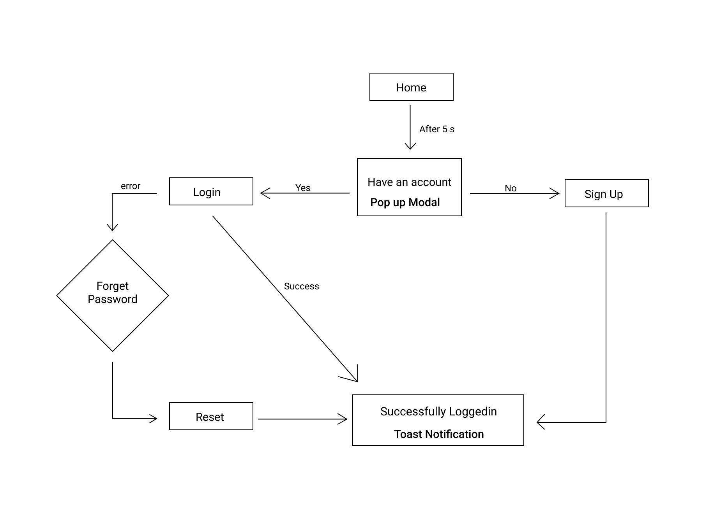

## Team Name \<Avinash> - \<Websites>

The participants are required to fork this repository and create a public Github repository under their own username (Single repository per team). *Clone the repo on your local system and build on top of that*

The following created sections in this README.md need to be duly filled, highlighting the denoted points for the solution/implementation. 

**Please feel free to create further sub-sections in this markdown.** The idea is to understand all the particulars of your solution in a singular document.

### Solution Description

Explain your solution to the problem in detail here.

#### Architecture Diagram

#### Technical Description

  * React

### Screenshots

### Demonstration Video 
Share link of your application demostration video. 

### Team Members
List of team member names and email IDs with their contributions.
|Member Name|Email|Contribution|
|-----------|-----|------------|
|Member 1|mem1@example.com|Something important|
|Member 2|mem2@example.com|Something important|
|Member 3|mem3@example.com|Something important|
|Member 4|mem4@example.com|Something important|

### References
You can see it live [here](https://forum2k-2022.web.app/) 

